# Tài liệu Cơ sở Dữ liệu (Database Documentation)

## 1. Phạm vi và Tổng quan
- Bao phủ các module: DMDA (Dự án), GT (Gói thầu), HD (Hợp đồng), CP (Chi phí), TSDV (Tài sản & Dịch vụ), Document Management.
- Nguồn tổng hợp từ các SRS trong thư mục gốc (`SRS_Project_Category_*.md`).
- Chuẩn đặt tên: `snake_case` cho cột, số đếm tiền tệ dùng `DECIMAL(15,2)`, ngày `DATE`, thời gian `TIMESTAMP`.
- Trường hệ thống phổ biến: `created_at`, `updated_at`, `created_by`, `updated_by` (tham chiếu `users`).

## 2. ERD (Mermaid)

```mermaid
erDiagram
    USERS ||--o{ TENDER_PACKAGES : created_by
    USERS ||--o{ TENDER_PACKAGES : updated_by
    USERS ||--o{ COST_ITEMS : created_by
    USERS ||--o{ COST_ITEMS : updated_by
    USERS ||--o{ COST_HISTORY : performed_by
    USERS ||--o{ CONTRACTS : created_by
    USERS ||--o{ CONTRACTS : updated_by
    USERS ||--o{ CONTRACT_AMENDMENTS : created_by
    USERS ||--o{ CONTRACT_AMENDMENTS : approved_by
    USERS ||--o{ PAYMENT_SCHEDULES : created_by
    USERS ||--o{ TENDER_DOCUMENTS : uploaded_by
    USERS ||--o{ DOCUMENT_HISTORY : performed_by
    USERS ||--o{ ASSETS_SERVICES : created_by
    USERS ||--o{ ASSETS_SERVICES : updated_by

    ROLES ||--o{ CONTRACT_EDIT_PERMISSIONS : has
    ROLES ||--o{ DOCUMENT_PERMISSIONS : has

    ORGANIZATIONS ||--o{ CONTRACTS : client
    ORGANIZATIONS ||--o{ CONTRACTS : contractor

    PROJECTS ||--o{ TENDER_PACKAGES : has
    PROJECTS ||--o{ COST_ITEMS : relates
    PROJECTS ||--o{ ASSETS_SERVICES : produces

    PROJECT_CATEGORY_YEARS ||--o{ PROJECTS : assigned

    TENDER_PACKAGES ||--o{ TENDER_PACKAGE_HISTORY : logs
    TENDER_PACKAGES ||--o{ TENDER_DOCUMENTS : contains
    TENDER_PACKAGES ||--o{ CONTRACTS : linked_by

    DOCUMENT_CATEGORIES ||--o{ DOCUMENT_PERMISSIONS : governs
    TENDER_DOCUMENTS ||--o{ DOCUMENT_HISTORY : changes

    CONTRACTS ||--o{ CONTRACT_AMENDMENTS : has
    CONTRACTS ||--o{ CONTRACT_DOCUMENTS : has
    CONTRACTS ||--o{ PAYMENT_SCHEDULES : has

    COST_ITEMS ||--o{ COST_PERIODS : has
    COST_ITEMS ||--o{ COST_ATTACHMENTS : has
    COST_ITEMS ||--o{ COST_HISTORY : logs
    COST_CATEGORIES ||--o{ COST_CATEGORIES : parent
    COST_CATEGORIES ||--o{ COST_APPROVAL_CONFIG : config

    ASSETS_SERVICES ||--o{ ASSET_DETAILS : has
    ASSETS_SERVICES ||--o{ SERVICE_DETAILS : has
    ASSETS_SERVICES ||--o{ ASSET_SERVICE_ATTACHMENTS : has
```

Ghi chú:
- `USERS`, `ROLES`, `ORGANIZATIONS` là các bảng tham chiếu ngoài phạm vi SRS hiện có (chỉ sử dụng làm khóa ngoại).
- Chi tiết cột xem tại phần Từ điển dữ liệu.

## 3. Từ điển Dữ liệu (Data Dictionary)

### 3.1. DMDA – Dự án

#### projects
- Mô tả: Bảng dự án.
- Khóa chính: `id`
- Chỉ mục: `project_code` (UNIQUE)

| Cột | Kiểu | Ràng buộc | Mô tả |
|---|---|---|---|
| id | INT | PK, AI | Định danh |
| project_code | VARCHAR(20) | NOT NULL, UNIQUE | PRJ-YYYY-XXXX |
| name | VARCHAR(255) | NOT NULL | Tên dự án |
| project_source | VARCHAR(100) | NOT NULL | Nguồn gốc dự án |
| project_type | ENUM('new','carryover') | NOT NULL | Loại dự án |
| project_category_year_id | INT | NULL, FK -> project_category_years(id) | Danh mục áp dụng theo năm |
| planned_budget | DECIMAL(15,2) | NULL | TMĐT dự kiến |
| approved_budget | DECIMAL(15,2) | NULL | TMĐT phê duyệt |
| total_disbursed | DECIMAL(15,2) | DEFAULT 0 | Lũy kế vốn đã ứng |
| current_year_disbursed | DECIMAL(15,2) | DEFAULT 0 | Đã ứng trong năm |
| expected_disbursement | DECIMAL(15,2) | NULL | Dự kiến sẽ ứng |
| next_year_plan | DECIMAL(15,2) | NULL | Kế hoạch năm sau |
| approval_status | ENUM('initialized','pending_approval','approved','rejected') | DEFAULT 'initialized' | Trạng thái phê duyệt |
| execution_status | ENUM('not_started','in_progress','suspended','completed') | DEFAULT 'not_started' | Trạng thái thực hiện |
| edit_request_status | ENUM('none','edit_requested') | DEFAULT 'none' | Trạng thái YC chỉnh sửa |
| created_at | TIMESTAMP | DEFAULT CURRENT_TIMESTAMP | |
| updated_at | TIMESTAMP | ON UPDATE CURRENT_TIMESTAMP | |

#### project_category_years
| Cột | Kiểu | Ràng buộc | Mô tả |
|---|---|---|---|
| id | INT | PK, AI | |
| category_code | VARCHAR(50) | NOT NULL | Mã danh mục (ổn định theo meaning) |
| year | SMALLINT | NOT NULL | Năm hiệu lực |
| name | VARCHAR(100) | NOT NULL | Tên hiển thị theo năm |
| description | TEXT | NULL | Mô tả theo năm |
| is_active | BOOLEAN | DEFAULT TRUE | Kích hoạt trong năm |
| sort_order | INT | DEFAULT 0 | Thứ tự |
| UNIQUE KEY | (category_code, year) | Đảm bảo 1 bản ghi/năm/mã |

### 3.2. GT – Gói thầu

#### tender_packages
- Khóa chính: `id`; Chỉ mục: `tender_code` (UNIQUE)
- Khóa ngoại: `project_id -> projects(id)`, `created_by/updated_by -> users(id)`

| Cột | Kiểu | Ràng buộc | Mô tả |
|---|---|---|---|
| id | INT | PK, AI | |
| tender_code | VARCHAR(20) | NOT NULL, UNIQUE | GT-YYYY-XXXX |
| name | VARCHAR(500) | NOT NULL | Tên gói thầu |
| description | TEXT | NULL | |
| project_id | INT | NOT NULL, FK | Dự án liên quan |
| tender_method | ENUM('open_tender','limited_tender','direct_appointment','competitive_consultation','other') | NOT NULL | Hình thức |
| estimated_value | DECIMAL(15,2) | NULL | Giá trị dự kiến |
| currency | VARCHAR(10) | DEFAULT 'VND' | |
| start_date | DATE | NULL | |
| end_date | DATE | NULL | |
| status | ENUM('draft','created','in_progress','completed','cancelled') | DEFAULT 'draft' | |
| tbmt_code | VARCHAR(100) | NULL | Mã TBMT |
| participant_count | INT | NULL | SL nhà thầu |
| hsmt_approval_decision | VARCHAR(200) | NULL | Quyết định HSMT |
| kqlcnt_approval_decision | VARCHAR(200) | NULL | Quyết định KQLCNT |
| winning_bid_value | DECIMAL(15,2) | NULL | Giá trúng |
| winning_contractor | VARCHAR(500) | NULL | Nhà thầu trúng |
| bitrix_task_id | INT | NULL | |
| bitrix_workflow_id | INT | NULL | |
| bitrix_status | VARCHAR(100) | NULL | |
| created_by | INT | NOT NULL, FK | |
| created_at | TIMESTAMP | DEFAULT CURRENT_TIMESTAMP | |
| updated_by | INT | NULL, FK | |
| updated_at | TIMESTAMP | ON UPDATE CURRENT_TIMESTAMP | |

#### tender_package_history
| Cột | Kiểu | Ràng buộc | Mô tả |
|---|---|---|---|
| id | INT | PK, AI | |
| tender_package_id | INT | NOT NULL, FK | -> tender_packages(id) |
| action_type | ENUM('created','updated','status_changed','bitrix_synced') | NOT NULL | |
| old_value | JSON | NULL | |
| new_value | JSON | NULL | |
| performed_by | INT | NOT NULL, FK | -> users(id) |
| performed_at | TIMESTAMP | DEFAULT CURRENT_TIMESTAMP | |
| notes | TEXT | NULL | |

#### bitrix_workflow_config
| Cột | Kiểu | Ràng buộc |
|---|---|---|
| id | INT | PK, AI |
| tender_method | ENUM('open_tender','limited_tender','direct_appointment','competitive_consultation','other') | NOT NULL |
| workflow_template_id | INT | NOT NULL |
| workflow_name | VARCHAR(200) | NOT NULL |
| is_active | BOOLEAN | DEFAULT TRUE |
| created_at | TIMESTAMP | DEFAULT CURRENT_TIMESTAMP |

#### tender_documents (GT-3.1)
| Cột | Kiểu | Ràng buộc |
|---|---|---|
| id | INT | PK, AI |
| tender_package_id | INT | NOT NULL, FK -> tender_packages(id) |
| file_name | VARCHAR(255) | NOT NULL |
| original_name | VARCHAR(255) | NOT NULL |
| file_path | VARCHAR(500) | NOT NULL |
| file_size | BIGINT | NOT NULL |
| file_type | VARCHAR(50) | NOT NULL |
| mime_type | VARCHAR(100) | NOT NULL |
| document_category | ENUM('approval','tender','contract','other') | NOT NULL |
| document_type | VARCHAR(100) | NULL |
| description | TEXT | NULL |
| tags | JSON | NULL |
| version | INT | DEFAULT 1 |
| is_active | BOOLEAN | DEFAULT TRUE |
| uploaded_by | INT | NOT NULL, FK -> users(id) |
| uploaded_at | TIMESTAMP | DEFAULT CURRENT_TIMESTAMP |
| updated_by | INT | NULL, FK -> users(id) |
| updated_at | TIMESTAMP | ON UPDATE CURRENT_TIMESTAMP |

#### document_history
| id (PK, AI), document_id (FK -> tender_documents), action_type ENUM('upload','update','delete','download','preview'), performed_by (FK users), performed_at TIMESTAMP, old_file_path, new_file_path, notes

#### document_categories / document_permissions
- `document_categories`: cấu hình loại tài liệu (name, code UNIQUE, is_required, allowed_file_types JSON, sort_order, is_active)
- `document_permissions`: phân quyền theo `role_id` (FK roles), `document_category` (code), các cờ: `can_upload`, `can_download`, `can_delete`, `can_preview` và UNIQUE(role_id, document_category)

### 3.3. HD – Hợp đồng

#### contracts
- Khóa ngoại: `client_id`, `contractor_id` -> `organizations(id)`; `contract_manager_id`, `contract_supervisor_id`, `created_by`, `updated_by` -> `users(id)`; `tender_package_id` -> `tender_packages(id)`

| Cột | Kiểu | Ràng buộc |
|---|---|---|
| id | INT | PK, AI |
| contract_number | VARCHAR(100) | NOT NULL, UNIQUE |
| contract_name | VARCHAR(500) | NOT NULL |
| contract_type | ENUM('construction','service','supply','consulting','other') | NOT NULL |
| contract_description | TEXT | NULL |
| contract_status | ENUM('draft','pending_approval','approved','active','completed','terminated','cancelled') | DEFAULT 'draft' |
| contract_value | DECIMAL(15,2) | NOT NULL |
| currency | VARCHAR(10) | DEFAULT 'VND' |
| payment_terms | TEXT | NULL |
| payment_schedule | JSON | NULL |
| budget_allocation | JSON | NULL |
| contract_start_date | DATE | NOT NULL |
| contract_end_date | DATE | NOT NULL |
| signing_date | DATE | NULL |
| effective_date | DATE | NULL |
| completion_date | DATE | NULL |
| client_id | INT | NOT NULL, FK |
| contractor_id | INT | NOT NULL, FK |
| contract_manager_id | INT | NOT NULL, FK |
| contract_supervisor_id | INT | NULL, FK |
| tender_package_id | INT | NULL, FK |
| tender_method | VARCHAR(100) | NULL |
| winning_bid_value | DECIMAL(15,2) | NULL |
| tender_evaluation | TEXT | NULL |
| created_by | INT | NOT NULL, FK |
| created_at | TIMESTAMP | DEFAULT CURRENT_TIMESTAMP |
| updated_by | INT | NULL, FK |
| updated_at | TIMESTAMP | ON UPDATE CURRENT_TIMESTAMP |

#### contract_amendments, contract_documents, payment_schedules, contract_edit_permissions
- `contract_amendments`: (contract_id FK, amendment_number, amendment_type ENUM, old/new JSON, dates, approved_by, created_by)
- `contract_documents`: (contract_id FK, metadata file upload, uploaded_by)
- `payment_schedules`: (contract_id FK, payment_number, description, amount, percentage, due_date, status ENUM, paid_amount, paid_date, notes)
- `contract_edit_permissions`: (role_id FK, field_name, can_edit, requires_approval, UNIQUE(role_id, field_name))

### 3.4. CP – Chi phí

#### cost_items
- Khóa ngoại: `project_id` -> `projects`, `tender_package_id` -> `tender_packages`, `contract_id` -> `contracts`, `created_by/updated_by/approved_by` -> `users`
- Chỉ mục: `idx_cost_code`, `idx_cost_type`, `idx_approval_status`, `idx_project_id`, `idx_contract_id`

| Cột | Kiểu | Ràng buộc |
|---|---|---|
| id | INT | PK, AI |
| cost_code | VARCHAR(20) | NOT NULL, UNIQUE |
| cost_name | VARCHAR(500) | NOT NULL |
| cost_description | TEXT | NULL |
| cost_category | VARCHAR(100) | NOT NULL |
| cost_subcategory | VARCHAR(100) | NULL |
| cost_type | ENUM('one_time','recurring') | NOT NULL |
| total_amount | DECIMAL(15,2) | NOT NULL |
| currency | VARCHAR(10) | DEFAULT 'VND' |
| vat_amount | DECIMAL(15,2) | DEFAULT 0 |
| vat_rate | DECIMAL(5,2) | DEFAULT 0 |
| frequency | ENUM('monthly','quarterly','annually') | NULL |
| number_of_periods | INT | NULL |
| cost_per_period | DECIMAL(15,2) | NULL |
| input_method | ENUM('same_cost','different_cost') | NULL |
| recurring_start_date | DATE | NULL |
| planned_start_date | DATE | NULL |
| planned_end_date | DATE | NULL |
| actual_start_date | DATE | NULL |
| actual_end_date | DATE | NULL |
| project_id | INT | NULL, FK |
| tender_package_id | INT | NULL, FK |
| contract_id | INT | NULL, FK |
| supplier_name | VARCHAR(200) | NULL |
| supplier_code | VARCHAR(50) | NULL |
| approval_status | ENUM('draft','pending','approved','rejected','cancelled') | DEFAULT 'draft' |
| approval_notes | TEXT | NULL |
| approved_by | INT | NULL, FK |
| approved_at | TIMESTAMP | NULL |
| priority | ENUM('low','medium','high','critical') | DEFAULT 'medium' |
| risk_level | ENUM('low','medium','high') | DEFAULT 'medium' |
| notes | TEXT | NULL |
| tags | JSON | NULL |
| created_by | INT | NOT NULL, FK |
| created_at | TIMESTAMP | DEFAULT CURRENT_TIMESTAMP |
| updated_by | INT | NULL, FK |
| updated_at | TIMESTAMP | ON UPDATE CURRENT_TIMESTAMP |

#### cost_periods
- Khóa: `UNIQUE(cost_item_id, period_number)`; FK `cost_item_id -> cost_items(id)`

| period_number INT, period_start_date DATE, period_end_date DATE, planned_amount DECIMAL(15,2), actual_amount DECIMAL(15,2) DEFAULT 0, payment_status ENUM('pending','partial','completed','cancelled'), payment_date DATE, payment_reference VARCHAR(100), notes TEXT, created_at TIMESTAMP, updated_at TIMESTAMP |

#### cost_attachments
- FK `cost_item_id -> cost_items(id)`, `uploaded_by -> users(id)`

#### cost_history
- FK `cost_item_id -> cost_items(id)`, `performed_by -> users(id)`; chỉ mục theo `action_type`

#### cost_categories
- Self FK `parent_category_id -> cost_categories(id)`; UNIQUE(category_name)

#### cost_approval_config
- FK `cost_category_id -> cost_categories(id)`; chỉ mục khoảng `cost_amount_min, cost_amount_max`

### 3.5. TSDV – Tài sản & Dịch vụ

#### assets_services
- FK: `source_project_id -> projects(id)`, `responsible_person_id/assigned_by/created_by/updated_by -> users(id)`

| Cột | Kiểu | Ràng buộc |
|---|---|---|
| id | INT | PK, AI |
| asset_service_code | VARCHAR(50) | NOT NULL, UNIQUE |
| name | VARCHAR(200) | NOT NULL |
| description | TEXT | NULL |
| type | ENUM('asset','service') | NOT NULL |
| category | VARCHAR(100) | NOT NULL |
| subcategory | VARCHAR(100) | NULL |
| source_project_id | INT | NOT NULL, FK |
| project_phase | VARCHAR(100) | NULL |
| creation_date | DATE | NOT NULL |
| completion_date | DATE | NULL |
| responsible_person_id | INT | NOT NULL, FK |
| assigned_by | INT | NOT NULL, FK |
| assigned_at | TIMESTAMP | DEFAULT CURRENT_TIMESTAMP |
| status | ENUM('draft','active','inactive','maintenance','retired','disposed') | DEFAULT 'draft' |
| priority | ENUM('low','medium','high','critical') | DEFAULT 'medium' |
| created_by | INT | NOT NULL, FK |
| created_at | TIMESTAMP | DEFAULT CURRENT_TIMESTAMP |
| updated_by | INT | NOT NULL, FK |
| updated_at | TIMESTAMP | ON UPDATE CURRENT_TIMESTAMP |

#### asset_details / service_details
- `asset_details`: chi tiết kỹ thuật, tài chính, bảo hành, vị trí; FK `asset_id -> assets_services(id)`
- `service_details`: SLA, provider, thời gian, tài chính, hiệu suất; FK `service_id -> assets_services(id)`

#### asset_service_attachments
- Tài liệu đính kèm cho `assets_services`; FK `asset_service_id -> assets_services(id)`, `uploaded_by -> users(id)`

#### asset_service_code_config
- Cấu hình sinh mã tự động: `code_type` ENUM('asset','service'), `prefix`, `sequence_format`, `year_format`, `current_sequence`, `is_active`

## 4. Ràng buộc, Chỉ mục và Quy tắc
- Mã định danh nghiệp vụ UNIQUE: `project_code`, `tender_code`, `cost_code`, `contract_number`, `asset_service_code`.
- Các FK ON DELETE CASCADE: chi tiết con như `cost_periods`, `tender_documents`, `document_history`, `contract_documents`, `payment_schedules`, `asset_details`, `service_details`, `asset_service_attachments` (theo SRS).
- Chỉ mục hiệu năng: theo trạng thái (`approval_status`, `payment_status`, `status`), liên kết (`project_id`, `contract_id`), tìm kiếm mã (`*_code`).

## 5. Thứ tự Migration gợi ý
1) Bảng tham chiếu nền: `users`, `roles`, `organizations` (ngoài phạm vi tài liệu này)
2) DMDA: `projects`, `project_category_years`
3) GT: `tender_packages`, `bitrix_workflow_config`, `tender_package_history`, `tender_documents`, `document_history`, `document_categories`, `document_permissions`
4) HD: `contracts`, `contract_amendments`, `contract_documents`, `payment_schedules`, `contract_edit_permissions`
5) CP: `cost_categories`, `cost_approval_config`, `cost_items`, `cost_periods`, `cost_attachments`, `cost_history`
6) TSDV: `assets_services`, `asset_details`, `service_details`, `asset_service_attachments`, `asset_service_code_config`

## 6. Phụ lục: Mapping Trạng thái (tham khảo SRS)
- DMDA/Projects: `approval_status`, `execution_status`, `edit_request_status`
- GT/Tender: `status`
- HD/Contracts: `contract_status`
- CP/Cost: `approval_status`, `payment_status` (kỳ)
- TSDV/Assets & Services: `status`

## 7. Phân tích Database

### 7.1 Mục tiêu thiết kế
- Đảm bảo toàn vẹn dữ liệu giữa các module (Projects ↔ Tenders ↔ Contracts ↔ Costs ↔ Assets/Services).
- Hỗ trợ báo cáo và truy vấn đa chiều với chỉ mục phù hợp.
- Dễ mở rộng theo năm, đặc biệt ở danh mục dự án (category per year).

### 7.2 Chuẩn hóa & Toàn vẹn (Normalization & Integrity)
- Mức chuẩn hóa mục tiêu: 3NF cho dữ liệu nghiệp vụ chính; sử dụng bảng con (history, attachments) để tách dữ liệu ghi log/nhị phân.
- Ràng buộc FK rõ ràng, ON DELETE CASCADE cho bảng chi tiết, history, attachments để tránh mồ côi dữ liệu.
- Các mã định danh nghiệp vụ sử dụng UNIQUE: `project_code`, `tender_code`, `contract_number`, `cost_code`, `asset_service_code`.
- Danh mục theo năm: `project_category_years` với UNIQUE `(category_code, year)` tránh trùng phiên bản.

### 7.3 Chiến lược Index & Truy vấn
- Chỉ mục đề xuất theo trường lọc phổ biến:
  - Projects: `idx_project_category_year_id(project_category_year_id)`, cân nhắc `project_year` nếu cần lọc theo năm nhiều.
  - Tenders: `tender_code`, `status`, `project_id`.
  - Contracts: `contract_number`, `contract_status`, `tender_package_id`.
  - Costs: `idx_cost_code`, `idx_cost_type`, `idx_approval_status`, `idx_project_id`, `idx_contract_id`.
  - Documents: `tender_package_id`, `document_category`, `file_type`.
- Truy vấn báo cáo nên ưu tiên SELECT theo chỉ mục, hạn chế LIKE leading wildcard, cân nhắc cột “denormalized/cache” nếu cần thống kê realtime.

### 7.4 Giao dịch & Nhất quán (Transactions)
- Bao bọc các thao tác đa bảng trong một transaction: ví dụ tạo tender → ghi history → sync Bitrix (ghi log), để đảm bảo atomicity.
- Mức isolation đề xuất: READ COMMITTED; nâng lên REPEATABLE READ khi thống kê quan trọng yêu cầu nhất quán ảnh chụp.

### 7.5 Khả năng mở rộng & Hiệu năng
- Phân tách hot tables (tenders, contracts, cost_items) khỏi bảng nặng nhị phân (attachments) để giảm IO.
- Sử dụng pagination theo khóa/ID thay vì OFFSET lớn cho danh sách lớn.
- Cân nhắc partition theo thời gian cho bảng log/history nếu >10M bản ghi (vd. theo tháng/quý).

### 7.6 Bảo mật & Phân quyền
- RBAC ở tầng ứng dụng; bảng `document_permissions`, `contract_edit_permissions` cho phép kiểm soát chi tiết.
- Mã nhạy cảm/tài liệu: lưu đường dẫn + metadata trong DB, file lưu ở storage an toàn (S3/GCS/NAS) kèm kiểm soát truy cập.
- Thực thi input validation, chống SQL injection; log truy cập tài liệu và thay đổi dữ liệu.

### 7.7 Audit & Logging
- Bảng lịch sử: `tender_package_history`, `cost_history`, `document_history` ghi rõ actor, thời điểm, old/new.
- Thêm các cột `created_by/updated_by/...` cho audit trail chuẩn hóa.

### 7.8 Vòng đời dữ liệu (Retention & Archival)
- Tài liệu đính kèm: chính sách lưu trữ/backup/retention theo loại tài liệu (approval, contract,...).
- History/log: lưu tối thiểu 12-24 tháng tại online storage; lâu hơn chuyển kho lưu trữ rẻ (glacier) nếu cần.

### 7.9 Chiến lược ENUM & Cấu hình
- ENUM dùng cho trạng thái ổn định (tender status, contract status). Với loại có thể mở rộng động (category, tags), dùng bảng cấu hình/JSON.
- Tránh lạm dụng ENUM cho danh mục biến đổi theo năm (đã thiết kế `project_category_years`).

### 7.10 Migration & Tương thích ngược
- Thứ tự migration đã đề xuất ở mục 5 để tránh lỗi FK.
- Khi mở rộng trường enum, dùng migration có kiểm thử; với bảng lớn cân nhắc online DDL.

### 7.11 Giám sát & Observability
- Chỉ số: tốc độ insert vào history/documents, thời gian truy vấn danh sách lớn, số lượng tài liệu, dung lượng lưu trữ.
- Thiết lập cảnh báo khi lỗi FK, deadlock, hoặc tăng đột biến thời gian truy vấn.

### 7.12 Rủi ro & Khuyến nghị
- Rủi ro phình to bảng history/documents: áp dụng partition + TTL/archival.
- Truy vấn báo cáo nặng: dùng chỉ mục phù hợp, xem xét vật hóa (materialized view) hoặc job tổng hợp định kỳ.
- Đồng bộ Bitrix: cô lập lỗi tích hợp (circuit breaker), log đầy đủ, retry idempotent.

Tài liệu này phản ánh cấu trúc cơ sở dữ liệu theo SRS hiện có và có thể được mở rộng khi nghiệp vụ thay đổi.
