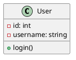
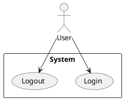
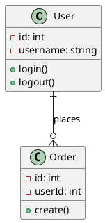
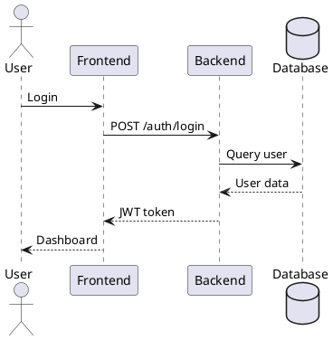
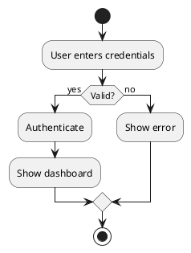
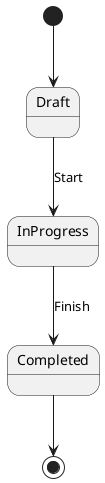
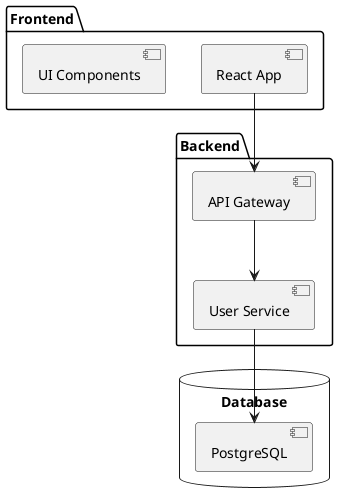

# Hướng dẫn Sử dụng PlantUML trong Dự án

## Tổng quan

PlantUML là một công cụ mạnh mẽ để tạo các sơ đồ UML và có thể được tích hợp vào tài liệu Markdown. Dự án này sử dụng PlantUML để tạo các sơ đồ trực quan cho các tài liệu SRS.

## Cấu trúc Dự án với PlantUML

```
document bitrix24/
├── diagrams/                          # Thư mục chứa sơ đồ PlantUML
│   ├── README.md                      # Hướng dẫn sử dụng PlantUML
│   ├── class-diagram.puml            # Sơ đồ class mẫu
│   ├── sequence-diagram.puml         # Sơ đồ sequence mẫu
│   ├── use-case-diagram.puml        # Sơ đồ use case mẫu
│   └── images/                       # Thư mục chứa hình ảnh render
│       ├── class-diagram.png
│       ├── sequence-diagram.png
│       └── use-case-diagram.png
├── plantuml_example.md               # Ví dụ sử dụng PlantUML
├── SRS_Project_Category_BC-1.1_with_diagrams.md  # SRS với sơ đồ tích hợp
└── PLANTUML_GUIDE.md                 # File này
```

## Cách Sử dụng PlantUML

### 1. Trong Markdown

#### Cách 1: Sử dụng code block
```markdown


#### Cách 2: Sử dụng hình ảnh
```markdown

```

#### Cách 3: Sử dụng PlantUML online
```markdown

```

### 2. Trong VS Code

1. **Cài đặt Extension**: PlantUML
2. **Xem Preview**: `Alt+Shift+P` → "PlantUML: Preview Current Diagram"
3. **Export**: `Alt+Shift+P` → "PlantUML: Export Current Diagram"

### 3. Render Command Line

```bash
# Cài đặt PlantUML
brew install plantuml  # macOS
# hoặc
sudo apt-get install plantuml  # Ubuntu

# Render sơ đồ
plantuml -tpng diagrams/class-diagram.puml
plantuml -tsvg diagrams/class-diagram.puml
```

## Các Loại Sơ đồ UML

### 1. Use Case Diagram


### 2. Class Diagram


### 3. Sequence Diagram


### 4. Activity Diagram


### 5. State Diagram


### 6. Component Diagram


## Quy ước Đặt tên

### File Names
- `use-case-diagram.puml` - Sơ đồ use case
- `class-diagram.puml` - Sơ đồ class
- `sequence-diagram.puml` - Sơ đồ sequence
- `activity-diagram.puml` - Sơ đồ activity
- `state-diagram.puml` - Sơ đồ state
- `component-diagram.puml` - Sơ đồ component
- `deployment-diagram.puml` - Sơ đồ deployment

### Naming Convention
- Sử dụng kebab-case cho tên file
- Mô tả rõ ràng chức năng của sơ đồ
- Thêm version nếu cần: `class-diagram-v2.puml`

## Tích hợp với GitHub

### GitHub không hỗ trợ PlantUML trực tiếp
- Sử dụng Mermaid thay thế
- Render sơ đồ thành hình ảnh
- Sử dụng external PlantUML service

### Mermaid Alternative
```markdown
```mermaid
classDiagram
    class User {
        +int id
        +string username
        +login()
        +logout()
    }
    class Order {
        +int id
        +int userId
        +create()
    }
    User ||--o{ Order : places
```
```

## Best Practices

### 1. Tổ chức Code
- Tách sơ đồ lớn thành nhiều file nhỏ
- Sử dụng include để tái sử dụng
- Tạo thư viện sơ đồ chung

### 2. Documentation
- Thêm mô tả cho mỗi sơ đồ
- Ghi chú các mối quan hệ quan trọng
- Cập nhật sơ đồ khi có thay đổi

### 3. Version Control
- Commit cả file `.puml` và hình ảnh
- Sử dụng meaningful commit messages
- Tag version cho sơ đồ quan trọng

### 4. Collaboration
- Review sơ đồ như code
- Thống nhất quy ước đặt tên
- Chia sẻ template và style

## Công cụ Hỗ trợ

### IDE Extensions
- **VS Code**: PlantUML
- **IntelliJ IDEA**: PlantUML Integration
- **Eclipse**: PlantUML Plugin

### Online Tools
- [PlantUML Online](http://www.plantuml.com/plantuml/)
- [PlantText](https://www.planttext.com/)
- [PlantUML Editor](https://plantuml-editor.kkeisuke.com/)

### Command Line
- PlantUML CLI
- Docker PlantUML
- CI/CD integration

## Troubleshooting

### Common Issues

1. **Sơ đồ không hiển thị**
   - Kiểm tra syntax PlantUML
   - Verify file encoding (UTF-8)
   - Check PlantUML installation

2. **Render lỗi**
   - Cài đặt Java Runtime Environment
   - Kiểm tra Graphviz installation
   - Verify file permissions

3. **Performance issues**
   - Tối ưu hóa sơ đồ lớn
   - Sử dụng caching
   - Split complex diagrams

### Debug Tips
- Sử dụng `@startuml debug` để debug
- Kiểm tra log files
- Test với sơ đồ đơn giản trước

## Tài liệu Tham khảo

- [PlantUML Official Documentation](https://plantuml.com/)
- [PlantUML Language Reference](https://plantuml.com/guide)
- [UML Diagrams Guide](https://www.uml-diagrams.org/)
- [PlantUML Cheat Sheet](https://plantuml.com/cheat-sheet)

## Ví dụ Thực tế

Xem file `SRS_Project_Category_BC-1.1_with_diagrams.md` để thấy cách tích hợp PlantUML vào tài liệu SRS thực tế.

## Kết luận

PlantUML là công cụ mạnh mẽ để tạo sơ đồ UML trong tài liệu Markdown. Với hướng dẫn này, bạn có thể:

1. Tạo sơ đồ UML chuyên nghiệp
2. Tích hợp vào tài liệu Markdown
3. Quản lý version control hiệu quả
4. Cộng tác với team dễ dàng

Hãy bắt đầu sử dụng PlantUML để làm cho tài liệu của bạn trở nên trực quan và dễ hiểu hơn!
