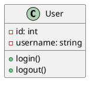
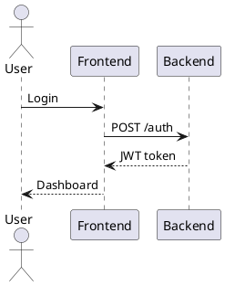
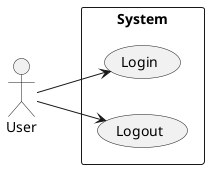
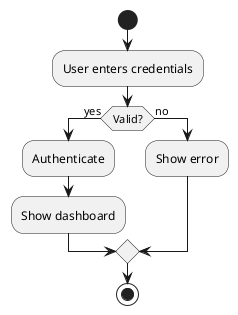

# 🌿 PlantUML to Markdown - Export ảnh và chèn vào MD

## ✅ **Đã tạo thành công các script:**

### 1. **Script cơ bản**
```bash
# Export từ file PlantUML
python3 scripts/plantuml_to_md.py --file diagrams/test-plantuml.puml output.md "Test Diagram"

# Export từ code trực tiếp
python3 scripts/plantuml_to_md.py "@startuml\nclass User\n@enduml" output.md "User Class"
```

### 2. **Script nâng cao**
```bash
# Export với nhiều tùy chọn
python3 scripts/advanced_plantuml_to_md.py --file diagrams/test-plantuml.puml --output output.md --caption "Test" --format png --size 600

# Export từ code với tùy chọn
python3 scripts/advanced_plantuml_to_md.py --code "@startuml\nclass User\n@enduml" --output output.md --format svg
```

## 🚀 **Cách sử dụng nhanh:**

### **Cách 1: Export từ file có sẵn**
```bash
python3 scripts/plantuml_to_md.py --file diagrams/test-plantuml.puml test_output.md "Test Diagram"
```

### **Cách 2: Export từ code trực tiếp**
```bash
python3 scripts/plantuml_to_md.py "@startuml\nclass User {\n  -id: int\n  +login()\n}\n@enduml" user_class.md "User Class"
```

### **Cách 3: Export với tùy chọn nâng cao**
```bash
python3 scripts/advanced_plantuml_to_md.py --file diagrams/test-plantuml.puml --output advanced.md --caption "Advanced Test" --format png --size 800
```

## 📋 **Các loại code PlantUML có thể export:**

### 1. **Class Diagram**


### 2. **Sequence Diagram**


### 3. **Use Case Diagram**


### 4. **Activity Diagram**


## 🔧 **Tính năng của các script:**

### `plantuml_to_md.py` (Cơ bản):
- ✅ Export từ file .puml
- ✅ Export từ code trực tiếp
- ✅ Chèn ảnh vào Markdown
- ✅ Tùy chọn caption và position

### `advanced_plantuml_to_md.py` (Nâng cao):
- ✅ Tất cả tính năng cơ bản
- ✅ Nhiều format (PNG, SVG, PDF)
- ✅ Tùy chọn kích thước ảnh
- ✅ Batch process nhiều file
- ✅ Tùy chọn vị trí chèn

## 🎯 **Cách sử dụng chi tiết:**

### **Export từ file PlantUML:**
```bash
# Cơ bản
python3 scripts/plantuml_to_md.py --file diagrams/test-plantuml.puml output.md "Test Diagram"

# Nâng cao
python3 scripts/advanced_plantuml_to_md.py --file diagrams/test-plantuml.puml --output output.md --caption "Test" --format png --size 600
```

### **Export từ code trực tiếp:**
```bash
# Cơ bản
python3 scripts/plantuml_to_md.py "@startuml\nclass User\n@enduml" output.md "User Class"

# Nâng cao
python3 scripts/advanced_plantuml_to_md.py --code "@startuml\nclass User\n@enduml" --output output.md --format svg
```

### **Batch process nhiều file:**
```bash
# Xử lý tất cả file .puml trong thư mục
python3 scripts/advanced_plantuml_to_md.py --batch diagrams --batch-output docs
```

## 📊 **Các format hỗ trợ:**

| Format | Mô tả | Ưu điểm | Nhược điểm |
|--------|-------|---------|------------|
| **PNG** | Ảnh bitmap | ✅ Chất lượng tốt, Phổ biến | ⚠️ File lớn |
| **SVG** | Vector graphics | ✅ Scalable, File nhỏ | ⚠️ Ít hỗ trợ |
| **PDF** | Document | ✅ In ấn tốt | ⚠️ Không hiển thị trực tiếp |

## 🎯 **Tùy chọn vị trí chèn:**

### **Cách 1: Chèn vào cuối file (mặc định)**
```bash
python3 scripts/plantuml_to_md.py --file test.puml output.md
```

### **Cách 2: Chèn vào đầu file**
```bash
python3 scripts/advanced_plantuml_to_md.py --file test.puml --output output.md --position start
```

### **Cách 3: Chèn vào dòng cụ thể**
```bash
python3 scripts/advanced_plantuml_to_md.py --file test.puml --output output.md --position 5
```

## 💡 **Tips sử dụng:**

### 1. **Escape ký tự đặc biệt:**
```bash
# Sử dụng \n cho newline
python3 scripts/plantuml_to_md.py "@startuml\nclass User\n@enduml" output.md

# Hoặc sử dụng dấu nháy kép
python3 scripts/plantuml_to_md.py "@startuml
class User
@enduml" output.md
```

### 2. **Export với kích thước tùy chỉnh:**
```bash
# Ảnh rộng 800px
python3 scripts/advanced_plantuml_to_md.py --file test.puml --output output.md --size 800

# Ảnh rộng 400px
python3 scripts/advanced_plantuml_to_md.py --file test.puml --output output.md --size 400
```

### 3. **Export với format khác:**
```bash
# Export SVG
python3 scripts/advanced_plantuml_to_md.py --file test.puml --output output.md --format svg

# Export PDF
python3 scripts/advanced_plantuml_to_md.py --file test.puml --output output.md --format pdf
```

## 🚀 **Bắt đầu ngay:**

### Test với file có sẵn:
```bash
python3 scripts/plantuml_to_md.py --file diagrams/test-plantuml.puml test_output.md "Test Diagram"
```

### Test với code đơn giản:
```bash
python3 scripts/plantuml_to_md.py "@startuml\nclass User\n@enduml" user_class.md "User Class"
```

### Test với tùy chọn nâng cao:
```bash
python3 scripts/advanced_plantuml_to_md.py --file diagrams/test-plantuml.puml --output advanced.md --caption "Advanced Test" --format png --size 600
```

## 🎉 **Kết quả:**

### ✅ **File Markdown được tạo:**
```markdown
# PlantUML Diagram


*Test Diagram*
```

### ✅ **Ảnh được lưu:**
- 📁 Thư mục: `diagrams/images/`
- 📄 Format: PNG, SVG, PDF
- 🎯 Tên file: `plantuml_YYYYMMDD_HHMMSS.{format}`

## 🎯 **Lợi ích:**

### ✅ **Tự động hóa:**
- Export ảnh tự động
- Chèn vào Markdown tự động
- Tạo caption tự động

### ✅ **Linh hoạt:**
- Nhiều format ảnh
- Tùy chọn kích thước
- Tùy chọn vị trí chèn

### ✅ **Dễ sử dụng:**
- Command line đơn giản
- Hỗ trợ batch process
- Tự động tạo thư mục

## 🎉 **Kết luận:**

**Bây giờ bạn có thể export PlantUML sang ảnh và chèn vào Markdown một cách dễ dàng!**

### ✅ **Có thể làm:**
- Export từ file .puml
- Export từ code trực tiếp
- Nhiều format (PNG, SVG, PDF)
- Tùy chọn kích thước và vị trí
- Batch process nhiều file

### 🚀 **Bắt đầu ngay:**
```bash
# Export cơ bản
python3 scripts/plantuml_to_md.py --file diagrams/test-plantuml.puml output.md "Test Diagram"

# Export nâng cao
python3 scripts/advanced_plantuml_to_md.py --file diagrams/test-plantuml.puml --output output.md --caption "Test" --format png --size 600
```

**Chúc bạn sử dụng PlantUML to Markdown hiệu quả! 🌿**
