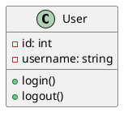
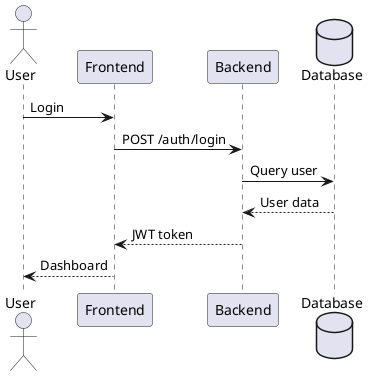
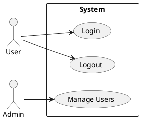
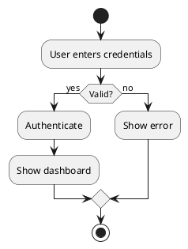
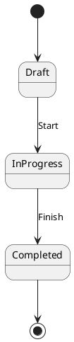

# Hướng dẫn Sử dụng PlantUML trong VS Code

## ✅ Đã cài đặt thành công:
- Java 17.0.2 (OpenJDK)
- PlantUML JAR file
- VS Code settings

## Bước 1: Cài đặt VS Code Extension

### 1. Mở VS Code
### 2. Cài đặt Extension
- Nhấn `Ctrl+Shift+X` (hoặc `Cmd+Shift+X` trên Mac)
- Tìm kiếm "PlantUML"
- Cài đặt extension "PlantUML" của jebbs

## Bước 2: Xem Preview PlantUML

### Cách 1: Sử dụng Command Palette
1. Mở file `.puml` trong VS Code
2. Nhấn `Alt+Shift+P` (hoặc `Cmd+Shift+P` trên Mac)
3. Gõ "PlantUML: Preview Current Diagram"
4. Chọn "PlantUML: Preview Current Diagram"

### Cách 2: Sử dụng Keyboard Shortcut
1. Mở file `.puml`
2. Nhấn `Ctrl+Shift+V` (hoặc `Cmd+Shift+V` trên Mac)
3. Chọn "PlantUML: Preview Current Diagram"

### Cách 3: Sử dụng Context Menu
1. Mở file `.puml`
2. Click chuột phải
3. Chọn "PlantUML: Preview Current Diagram"

## Bước 3: Export Diagram

### Export PNG
1. Nhấn `Alt+Shift+P`
2. Chọn "PlantUML: Export Current Diagram"
3. Chọn "PNG"

### Export SVG
1. Nhấn `Alt+Shift+P`
2. Chọn "PlantUML: Export Current Diagram"
3. Chọn "SVG"

### Export PDF
1. Nhấn `Alt+Shift+P`
2. Chọn "PlantUML: Export Current Diagram"
3. Chọn "PDF"

## Test ngay bây giờ

### 1. Mở file test
```bash
# Mở file test trong VS Code
code diagrams/test-plantuml.puml
```

### 2. Xem preview
- Nhấn `Alt+Shift+P`
- Chọn "PlantUML: Preview Current Diagram"

### 3. Export diagram
- Nhấn `Alt+Shift+P`
- Chọn "PlantUML: Export Current Diagram"
- Chọn format mong muốn

## Các loại sơ đồ PlantUML

### 1. Class Diagram


### 2. Sequence Diagram


### 3. Use Case Diagram


### 4. Activity Diagram


### 5. State Diagram


## Sử dụng Command Line

### Export PNG
```bash
java -jar plantuml.jar diagrams/your-file.puml
```

### Export SVG
```bash
java -jar plantuml.jar -tsvg diagrams/your-file.puml
```

### Export PDF
```bash
java -jar plantuml.jar -tpdf diagrams/your-file.puml
```

## Cấu hình VS Code

### Settings đã được tạo:
```json
{
  "plantuml.server": "PlantUMLServer",
  "plantuml.render": "PlantUMLServer",
  "plantuml.exportFormat": "png",
  "plantuml.plantumlServer": "https://www.plantuml.com/plantuml",
  "plantuml.diagramsRoot": "diagrams",
  "plantuml.exportOutDir": "diagrams/images"
}
```

### Keyboard Shortcuts (tùy chọn)
Thêm vào `keybindings.json`:
```json
[
  {
    "key": "ctrl+shift+p",
    "command": "plantuml.preview",
    "when": "editorLangId == plantuml"
  }
]
```

## Troubleshooting

### Lỗi "Unable to locate a Java Runtime"
- Java đã được cài đặt: `java -version`
- PlantUML JAR đã có: `ls plantuml.jar`

### Lỗi "Dot executable does not exist"
- Chỉ ảnh hưởng đến một số loại diagram
- Sequence diagram vẫn hoạt động bình thường

### Extension không hoạt động
1. Restart VS Code
2. Kiểm tra extension đã cài đặt
3. Kiểm tra file `.puml` có syntax đúng

## Lợi ích của PlantUML

1. **Syntax mạnh mẽ** - Hỗ trợ nhiều loại diagram
2. **Preview trực tiếp** - Xem ngay trong VS Code
3. **Export nhiều format** - PNG, SVG, PDF
4. **Version control** - Code có thể commit
5. **Tự động generate** - Không cần vẽ thủ công

## So sánh với Mermaid

| Tính năng | PlantUML | Mermaid |
|-----------|----------|---------|
| **Loại diagram** | Nhiều | Ít hơn |
| **Syntax** | Phức tạp | Đơn giản |
| **Preview** | VS Code | GitHub |
| **Cài đặt** | Java + Extension | Extension |
| **Export** | Nhiều format | Ít format |

## Kết luận

PlantUML đã được cài đặt và cấu hình thành công! Bạn có thể:

1. **Xem preview** trực tiếp trong VS Code
2. **Export diagram** thành PNG, SVG, PDF
3. **Sử dụng command line** để generate
4. **Version control** code PlantUML

**Bắt đầu ngay:** Mở file `diagrams/test-plantuml.puml` và thử xem preview!
