# 📊 DIAGRAMS INDEX - Tổng hợp các Activity & Sequence Diagrams

## 📋 Tổng quan
- **Tổng số diagram**: 25 diagrams
- **Activity diagrams**: 13 diagrams  
- **Sequence diagrams**: 12 diagrams
- **Ngôn ngữ**: Tiếng Việt
- **Định dạng**: PlantUML (.puml)

---

## 🏢 CP Series - Chi phí (Cost Management)

### CP-1.3: Cập nhật Trạng thái Thanh toán
- **Activity Diagram**: `cp-1.3-activity-diagram.puml`
- **Sequence Diagram**: `cp-1.3-sequence-diagram.puml`
- **Mô tả**: Quy trình cập nhật trạng thái thanh toán cho khoản mục chi phí

### CP-2.1: Chỉnh sửa thông tin khoản mục chi phí
- **Activity Diagram**: `cp-2.1-activity-diagram.puml`
- **Sequence Diagram**: `cp-2.1-sequence-diagram.puml`
- **Mô tả**: Quy trình chỉnh sửa thông tin chi tiết khoản mục chi phí

### CP-2.2: Xóa khoản mục chi phí
- **Activity Diagram**: `cp-2.2-activity-diagram.puml`
- **Sequence Diagram**: `cp-2.2-sequence-diagram.puml`
- **Mô tả**: Quy trình xóa khoản mục chi phí (soft delete/hard delete)

### CP-5.1: Ghi nhận Lịch sử Thao tác Chi phí (Log)
- **Activity Diagram**: `cp-5.1-activity-diagram.puml`
- **Sequence Diagram**: `cp-5.1-sequence-diagram.puml`
- **Mô tả**: Quy trình ghi nhận và theo dõi lịch sử thao tác chi phí

### CP-5.2: Tìm kiếm & Lọc Chi phí Đa tiêu chí
- **Activity Diagram**: `cp-5.2-activity-diagram.puml`
- **Sequence Diagram**: `cp-5.2-sequence-diagram.puml`
- **Mô tả**: Quy trình tìm kiếm và lọc chi phí theo nhiều tiêu chí

### CP-5.3: Tổng hợp & Báo cáo Chi phí theo Dự án/Gói thầu/Hợp đồng
- **Activity Diagram**: `cp-5.3-activity-diagram.puml`
- **Sequence Diagram**: `cp-5.3-sequence-diagram.puml`
- **Mô tả**: Quy trình tạo báo cáo tổng hợp chi phí theo đối tượng

### CP-5.4: Xuất Dữ liệu Chi phí ra Excel
- **Activity Diagram**: `cp-5.4-activity-diagram.puml`
- **Sequence Diagram**: `cp-5.4-sequence-diagram.puml`
- **Mô tả**: Quy trình xuất dữ liệu chi phí ra file Excel

### CP-5.5: Hiển thị các Chỉ số Tài chính & Tiến độ Tổng hợp của Dự án
- **Activity Diagram**: `cp-5.5-activity-diagram.puml`
- **Sequence Diagram**: `cp-5.5-sequence-diagram.puml`
- **Mô tả**: Quy trình tính toán và hiển thị chỉ số tài chính dự án

### CP-5.6: Cảnh báo khi Tổng Chi phí Vượt quá Ngân sách Dự án
- **Activity Diagram**: `cp-5.6-activity-diagram.puml`
- **Sequence Diagram**: `cp-5.6-sequence-diagram.puml`
- **Mô tả**: Quy trình cảnh báo tự động khi chi phí vượt ngân sách

---

## 🏗️ TSDV Series - Tài sản & Dịch vụ (Assets & Services)

### TSDV-1.1: Tạo mới một Tài sản/Dịch vụ đầu ra từ dự án
- **Activity Diagram**: `tsdv-1.1-activity-diagram.puml`
- **Sequence Diagram**: `tsdv-1.1-sequence-diagram.puml`
- **Mô tả**: Quy trình tạo mới tài sản hoặc dịch vụ từ dự án

### TSDV-1.2: Chỉnh sửa thông tin Tài sản/Dịch vụ
- **Activity Diagram**: `tsdv-1.2-activity-diagram.puml`
- **Sequence Diagram**: `tsdv-1.2-sequence-diagram.puml`
- **Mô tả**: Quy trình chỉnh sửa thông tin tài sản/dịch vụ

### TSDV-3.1: Theo dõi lịch sử sử dụng, bảo hành, bảo dưỡng của Tài sản
- **Activity Diagram**: `tsdv-3.1-activity-diagram.puml`
- **Sequence Diagram**: `tsdv-3.1-sequence-diagram.puml`
- **Mô tả**: Quy trình theo dõi lịch sử sử dụng và bảo trì tài sản

### TSDV-3.2: Nhắc nhở khi Tài sản/Dịch vụ sắp hết hạn bảo hành/bảo trì/sử dụng
- **Activity Diagram**: `tsdv-3.2-activity-diagram.puml`
- **Sequence Diagram**: `tsdv-3.2-sequence-diagram.puml`
- **Mô tả**: Quy trình nhắc nhở tự động khi tài sản/dịch vụ sắp hết hạn

---

## 📊 Thống kê theo Loại

### Activity Diagrams (13)
1. `cp-1.3-activity-diagram.puml`
2. `cp-2.1-activity-diagram.puml`
3. `cp-2.2-activity-diagram.puml`
4. `cp-5.1-activity-diagram.puml`
5. `cp-5.2-activity-diagram.puml`
6. `cp-5.3-activity-diagram.puml`
7. `cp-5.4-activity-diagram.puml`
8. `cp-5.5-activity-diagram.puml`
9. `cp-5.6-activity-diagram.puml`
10. `tsdv-1.1-activity-diagram.puml`
11. `tsdv-1.2-activity-diagram.puml`
12. `tsdv-3.1-activity-diagram.puml`
13. `tsdv-3.2-activity-diagram.puml`

### Sequence Diagrams (12)
1. `cp-1.3-sequence-diagram.puml`
2. `cp-2.1-sequence-diagram.puml`
3. `cp-2.2-sequence-diagram.puml`
4. `cp-5.1-sequence-diagram.puml`
5. `cp-5.2-sequence-diagram.puml`
6. `cp-5.3-sequence-diagram.puml`
7. `cp-5.4-sequence-diagram.puml`
8. `cp-5.5-sequence-diagram.puml`
9. `cp-5.6-sequence-diagram.puml`
10. `tsdv-1.1-sequence-diagram.puml`
11. `tsdv-1.2-sequence-diagram.puml`
12. `tsdv-3.1-sequence-diagram.puml`
13. `tsdv-3.2-sequence-diagram.puml`

---

## 🎨 Đặc điểm Kỹ thuật

### Theme & Styling
- **Theme**: Plain theme với màu sắc nhất quán
- **Background**: #FFFFFF (trắng)
- **Activity**: #E3F2FD (xanh nhạt)
- **Actor**: #FFF3E0 (cam nhạt)
- **Database**: #F3E5F5 (tím nhạt)

### Cấu trúc chuẩn

```plantuml
@startuml [Tên Diagram]
!theme plain
skinparam backgroundColor #FFFFFF
skinparam activity {
  BackgroundColor #E3F2FD
  BorderColor #1976D2
  FontColor #0D47A1
}
// ... các skinparam khác
title [Tiêu đề bằng tiếng Việt]
// ... nội dung diagram
@enduml
```


---

## 📁 Cấu trúc Thư mục

```
diagrams/
├── DIAGRAMS_INDEX.md (file này)
├── cp-1.3-activity-diagram.puml
├── cp-1.3-sequence-diagram.puml
├── cp-2.1-activity-diagram.puml
├── cp-2.1-sequence-diagram.puml
├── cp-2.2-activity-diagram.puml
├── cp-2.2-sequence-diagram.puml
├── cp-5.1-activity-diagram.puml
├── cp-5.1-sequence-diagram.puml
├── cp-5.2-activity-diagram.puml
├── cp-5.2-sequence-diagram.puml
├── cp-5.3-activity-diagram.puml
├── cp-5.3-sequence-diagram.puml
├── cp-5.4-activity-diagram.puml
├── cp-5.4-sequence-diagram.puml
├── cp-5.5-activity-diagram.puml
├── cp-5.5-sequence-diagram.puml
├── cp-5.6-activity-diagram.puml
├── cp-5.6-sequence-diagram.puml
├── tsdv-1.1-activity-diagram.puml
├── tsdv-1.1-sequence-diagram.puml
├── tsdv-1.2-activity-diagram.puml
├── tsdv-1.2-sequence-diagram.puml
├── tsdv-3.1-activity-diagram.puml
├── tsdv-3.1-sequence-diagram.puml
├── tsdv-3.2-activity-diagram.puml
└── tsdv-3.2-sequence-diagram.puml
```

---

## 🔧 Cách sử dụng

### Xem diagram
1. Mở file `.puml` trong editor hỗ trợ PlantUML
2. Hoặc sử dụng PlantUML extension trong VS Code
3. Hoặc chuyển đổi sang PNG/PDF bằng PlantUML server

### Chỉnh sửa diagram
1. Mở file `.puml` cần chỉnh sửa
2. Thay đổi nội dung theo cú pháp PlantUML
3. Lưu file và xem preview

### Thêm diagram mới
1. Tạo file `.puml` mới theo naming convention
2. Sử dụng template cấu trúc chuẩn
3. Cập nhật index này

---

## 📝 Ghi chú

- Tất cả diagram đều sử dụng tiếng Việt
- Cấu trúc nhất quán và dễ bảo trì
- Hỗ trợ đầy đủ các tính năng PlantUML
- Có thể mở rộng thêm diagram mới dễ dàng

---

*Cập nhật lần cuối: [Ngày hiện tại]*
*Tổng số diagram: 25*
