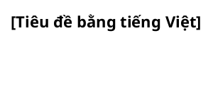
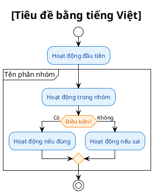

# 📊 PlantUML Diagrams - Hướng dẫn sử dụng

## 🎯 Mục đích
Bộ sưu tập các Activity và Sequence diagrams cho hệ thống quản lý dự án, được viết bằng PlantUML và hoàn toàn bằng tiếng Việt.

## 📁 Cấu trúc Files

### 📋 Index chính
- `DIAGRAMS_INDEX.md` - File tổng hợp tất cả diagrams

### 🏢 CP Series (Chi phí)
**CP-1.3: Cập nhật Trạng thái Thanh toán**
- `cp-1.3-activity-diagram.puml`
- `cp-1.3-sequence-diagram.puml`

**CP-2.1: Chỉnh sửa thông tin khoản mục chi phí**
- `cp-2.1-activity-diagram.puml`
- `cp-2.1-sequence-diagram.puml`

**CP-2.2: Xóa khoản mục chi phí**
- `cp-2.2-activity-diagram.puml`
- `cp-2.2-sequence-diagram.puml`

**CP-5.1: Ghi nhận Lịch sử Thao tác Chi phí**
- `cp-5.1-activity-diagram.puml`
- `cp-5.1-sequence-diagram.puml`

**CP-5.2: Tìm kiếm & Lọc Chi phí Đa tiêu chí**
- `cp-5.2-activity-diagram.puml`
- `cp-5.2-sequence-diagram.puml`

**CP-5.3: Tổng hợp & Báo cáo Chi phí**
- `cp-5.3-activity-diagram.puml`
- `cp-5.3-sequence-diagram.puml`

**CP-5.4: Xuất Dữ liệu Chi phí ra Excel**
- `cp-5.4-activity-diagram.puml`
- `cp-5.4-sequence-diagram.puml`

**CP-5.5: Hiển thị Chỉ số Tài chính & Tiến độ**
- `cp-5.5-activity-diagram.puml`
- `cp-5.5-sequence-diagram.puml`

**CP-5.6: Cảnh báo Vượt Ngân sách**
- `cp-5.6-activity-diagram.puml`
- `cp-5.6-sequence-diagram.puml`

### 🏗️ TSDV Series (Tài sản & Dịch vụ)
**TSDV-1.1: Tạo mới Tài sản/Dịch vụ**
- `tsdv-1.1-activity-diagram.puml`
- `tsdv-1.1-sequence-diagram.puml`

**TSDV-1.2: Chỉnh sửa thông tin Tài sản/Dịch vụ**
- `tsdv-1.2-activity-diagram.puml`
- `tsdv-1.2-sequence-diagram.puml`

**TSDV-3.1: Theo dõi lịch sử sử dụng, bảo hành, bảo dưỡng**
- `tsdv-3.1-activity-diagram.puml`
- `tsdv-3.1-sequence-diagram.puml`

**TSDV-3.2: Nhắc nhở hết hạn bảo hành/bảo trì**
- `tsdv-3.2-activity-diagram.puml`
- `tsdv-3.2-sequence-diagram.puml`

## 🛠️ Cách sử dụng

### 1. Xem Diagrams
```bash
# Sử dụng PlantUML extension trong VS Code
# Hoặc mở file .puml trong editor hỗ trợ PlantUML
```

### 2. Chuyển đổi sang PNG/PDF
```bash
# Sử dụng PlantUML server
java -jar plantuml.jar diagram.puml

# Hoặc sử dụng online server
# https://www.plantuml.com/plantuml/
```

### 3. Chỉnh sửa Diagrams
1. Mở file `.puml` cần chỉnh sửa
2. Thay đổi nội dung theo cú pháp PlantUML
3. Lưu file và xem preview

## 🎨 Theme & Styling

### Màu sắc chuẩn
- **Background**: #FFFFFF (trắng)
- **Activity**: #E3F2FD (xanh nhạt)
- **Actor**: #FFF3E0 (cam nhạt)
- **Database**: #F3E5F5 (tím nhạt)
- **Decision**: #FFF3E0 (cam nhạt)

### Cấu trúc chuẩn


## 📊 Thống kê

### Tổng quan
- **Tổng số diagram**: 25
- **Activity diagrams**: 13
- **Sequence diagrams**: 12
- **CP Series**: 18 diagrams
- **TSDV Series**: 7 diagrams

### Phân loại theo chức năng
- **Quản lý chi phí**: 18 diagrams
- **Quản lý tài sản**: 7 diagrams
- **Báo cáo & Xuất dữ liệu**: 6 diagrams
- **Cảnh báo & Thông báo**: 4 diagrams

## 🔧 Tính năng đặc biệt

### Activity Diagrams
- ✅ Luồng xử lý chi tiết
- ✅ Phân nhánh điều kiện
- ✅ Tùy chọn và ngoại lệ
- ✅ Ghi chú và mô tả

### Sequence Diagrams
- ✅ Tương tác giữa các component
- ✅ API calls và database operations
- ✅ Error handling
- ✅ Notification flows

## 📝 Quy ước đặt tên

### Naming Convention
```
[module]-[story-id]-[diagram-type]-diagram.puml
```

**Ví dụ:**
- `cp-1.3-activity-diagram.puml`
- `tsdv-3.1-sequence-diagram.puml`

### Module Prefix
- `cp-` = Chi phí (Cost)
- `tsdv-` = Tài sản & Dịch vụ (Assets & Services)

## 🚀 Mở rộng

### Thêm diagram mới
1. Tạo file `.puml` theo naming convention
2. Sử dụng template cấu trúc chuẩn
3. Cập nhật `DIAGRAMS_INDEX.md`
4. Thêm vào README này

### Template cho diagram mới


## 📞 Hỗ trợ

Nếu cần hỗ trợ hoặc có câu hỏi về:
- Cú pháp PlantUML
- Cấu trúc diagram
- Thêm diagram mới
- Chỉnh sửa diagram hiện có

Vui lòng tham khảo:
- [PlantUML Documentation](https://plantuml.com/)
- [DIAGRAMS_INDEX.md](./DIAGRAMS_INDEX.md) - File tổng hợp chi tiết

---

*Cập nhật lần cuối: [Ngày hiện tại]*
*Phiên bản: 1.0*
