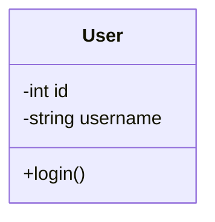

# Class Diagram - Mermaid Version

## Sơ đồ Class với Mermaid

```mermaid
classDiagram
    class User {
        -int id
        -string username
        -string email
        -string password
        -datetime createdAt
        -datetime updatedAt
        +login()
        +logout()
        +updateProfile()
        +changePassword()
    }
    
    class Product {
        -int id
        -string name
        -text description
        -decimal price
        -int stock
        -int categoryId
        -datetime createdAt
        -datetime updatedAt
        +create()
        +update()
        +delete()
        +checkStock()
    }
    
    class Category {
        -int id
        -string name
        -text description
        -int parentId
        -datetime createdAt
        -datetime updatedAt
        +create()
        +update()
        +delete()
        +getSubcategories()
    }
    
    class Order {
        -int id
        -int userId
        -decimal totalAmount
        -string status
        -text shippingAddress
        -datetime createdAt
        -datetime updatedAt
        +placeOrder()
        +cancelOrder()
        +updateStatus()
        +calculateTotal()
    }
    
    class OrderItem {
        -int id
        -int orderId
        -int productId
        -int quantity
        -decimal unitPrice
        +calculateSubtotal()
    }
    
    class Payment {
        -int id
        -int orderId
        -decimal amount
        -string method
        -string status
        -string transactionId
        -datetime createdAt
        +processPayment()
        +refund()
    }
    
    User ||--o{ Order : places
    Category ||--o{ Product : contains
    Order ||--o{ OrderItem : includes
    Product ||--o{ OrderItem : referenced_by
    Order ||--|| Payment : has
    Category ||--o{ Category : parent_child
```

## Lợi ích của Mermaid

1. **Không cần Java** - Hoạt động trực tiếp mà không cần cài đặt
2. **Preview trực tiếp** - Hiển thị ngay trong Markdown
3. **Hỗ trợ GitHub** - Hoạt động trên GitHub/GitLab
4. **Syntax đơn giản** - Dễ học và sử dụng
5. **Tương thích tốt** - Hoạt động trên nhiều platform

## So sánh với PlantUML

| Tính năng | PlantUML | Mermaid |
|-----------|----------|---------|
| **Cần Java** | ✅ | ❌ |
| **Preview trực tiếp** | ✅ (VS Code) | ✅ |
| **Hỗ trợ GitHub** | ❌ | ✅ |
| **Syntax** | Phức tạp | Đơn giản |
| **Loại sơ đồ** | Nhiều | Ít hơn |
| **Cài đặt** | Phức tạp | Không cần |

## Cách sử dụng

### Trong GitHub/GitLab:
```markdown

```

### Trong VS Code:
- Cài đặt extension "Markdown Preview Mermaid Support"
- Xem preview với `Ctrl+Shift+V`

### Trong các Markdown viewer khác:
- Hầu hết đều hỗ trợ Mermaid
- Chỉ cần code block với `mermaid`
